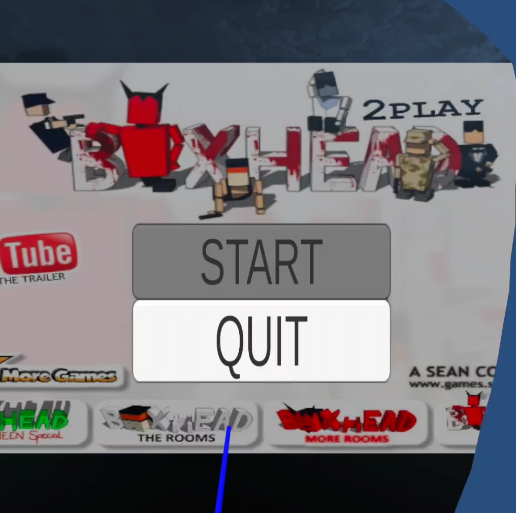
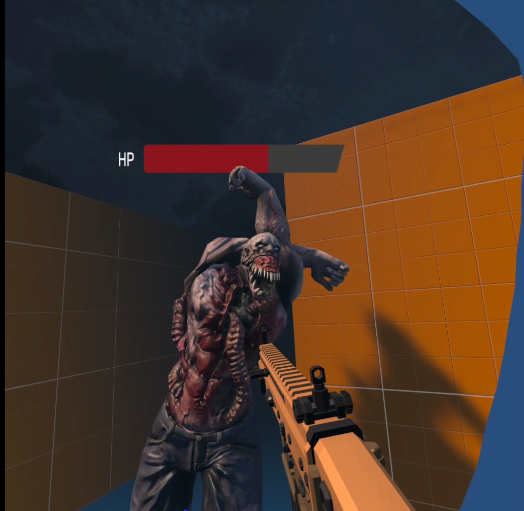
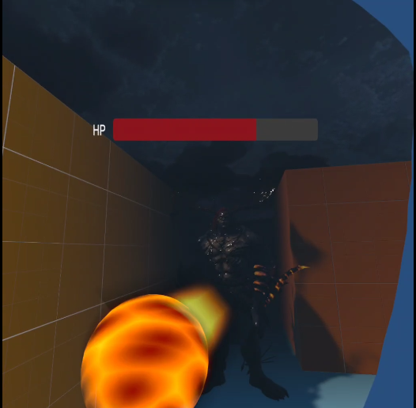
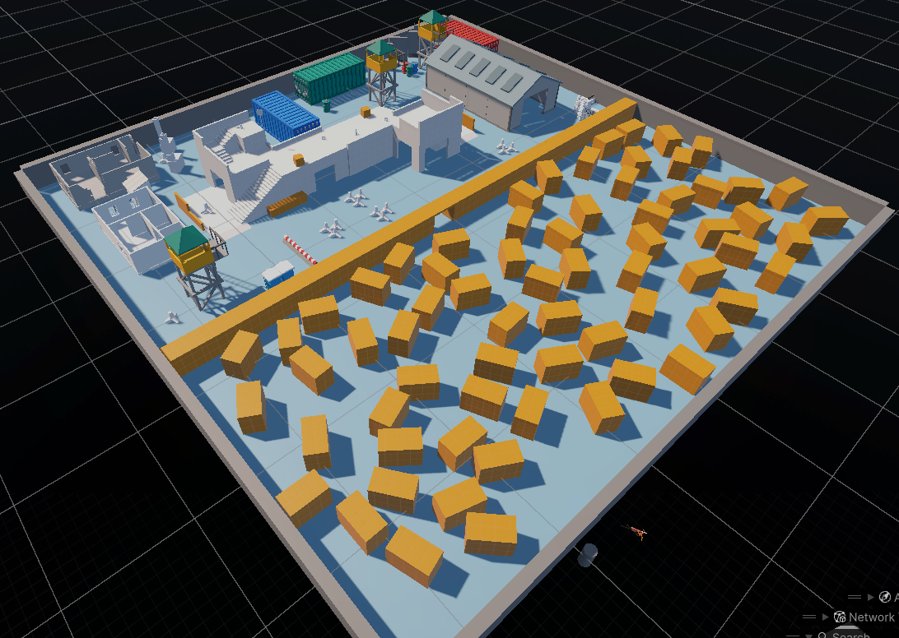

# BoxHeadVR



A virtual reality zombie survival game where you fight waves of enemies in an immersive VR environment. Built with Unity and Meta XR SDK for Quest 2/3 devices.

**An XR Project by Team 3 for 50.052 Extended Reality**

---

## 📋 Table of Contents

- [About the Game](#about-the-game)
- [Getting Started](#getting-started)
- [How to Play](#how-to-play)
- [Controls](#controls)
- [Development](#development)
- [Acknowledgments](#acknowledgments)

---

## 🎮 About the Game

BoxHeadVR is an immersive VR survival shooter where players must defend themselves against waves of enemies using various weapons. Experience intense combat in virtual reality with realistic hand interactions powered by Meta's Interaction SDK.

**Inspired by the classic Y8 flash game "Boxhead" created by Sean Cooper and developed by CrazyMonkeyGames.**

### Enemy Types

<div align="center">
  
  
  <p><i>Face off against regular zombies and powerful boss enemies</i></p>
</div>

### Game Environment

<div align="center">
  
  <p><i>Battle through intense arena environments</i></p>
</div>

### Features

- **VR Combat System**: Use controllers to wield weapons
- **Multiple Weapon Types**: Including Magic Staff, guns, and melee weapons
- **Enemy AI**: Fight against intelligent enemy waves with navigation
- **Immersive Environment**: Fully 3D environments optimized for VR
- **Audio Feedback**: Spatial audio for enhanced immersion

---

## 🚀 Getting Started

### Prerequisites

- **Unity Editor**: Version 2022.3 or later
- **Meta Quest Device**: Quest 2 or Quest 3
- **Git**: For cloning the repository
- **Meta Quest Developer Hub** (optional): For easier deployment

### Installation

1. **Clone the Repository**

   ```bash
   git clone https://github.com/jialetoh/xr-project-team3-2025.git
   cd xr-project-team3-2025
   ```

2. **Open in Unity**

   - Launch Unity Hub
   - Click "Add" and select the cloned project folder
   - Open the project (Unity will import assets on first launch)

3. **Configure Build Settings**
   - Go to `File > Build Settings`
   - Select `Meta Quest` as the platform
   - Click "Switch Platform" if not already on Android
   - Go to `Edit > Project Settings > XR Plug-in Management`
   - Enable "Oculus" under Android settings

### Building and Deploying

1. **Connect Your Quest Device**

   - Enable Developer Mode on your Quest headset
   - Connect via USB-C cable or use Air Link

2. **Build and Run**
   - Go to `File > Build Settings`
   - Click "Build And Run"
   - Select a location to save the APK
   - The game will automatically install and launch on your headset

---

## 🎯 How to Play

### Objective

Survive waves of enemies by using various weapons and abilities. Eliminate threats before they overwhelm you!

### Gameplay Loop

1. **Start the Game**: Put on your VR headset and launch BoxHeadVR
2. **Grab Weapons**: Use your controllers to handle your weapons
3. **Fight Enemies**: Aim and shoot at incoming enemies
4. **Survive Waves**: Each wave gets progressively harder
5. **Manage Resources**: Keep track of health

### Tips

- Stay mobile to avoid getting surrounded
- Use the environment for cover
- Listen for audio cues indicating enemy positions

---

## 🕹️ Controls

### Meta Quest Controllers

- **Left Trigger**: Grab and interact with magazine
- **right Trigger**: Fire weapon / Attack
- **Right Grip Button**: Release magazine from gun
- **Left Thumbstick**: Movement (if locomotion enabled)
- **Right Thumbstick**: Panning (if locomotion enabled)
- **A Button**: Jump
- **Left Menu Button**: Pause

---

## 💻 Development

### Project Structure

```
Assets/
├── Scripts/          # C# game logic
├── Prefabs/          # Reusable game objects
├── Scenes/           # Game levels
├── Materials/        # Textures and shaders
├── Audio/            # Sound effects and music
├── Animations/       # Character animations
├── Weapons/          # Weapon prefabs and configs
└── XR/               # VR-specific assets
```

### Key Systems

- **Projectile System**: Base class for all projectiles with damage and collision detection
- **Weapon System**: Handles weapon mechanics and firing
- **Enemy AI**: Navigation mesh-based enemy movement
- **Damage System**: IDamageable interface for health management
- **Audio System**: 3D spatial audio for immersive sound

### Testing in Editor

You can test basic functionality in the Unity Editor using:

- **XR Device Simulator**: Window > XR > XR Device Simulator
- **Play Mode**: Test non-VR interactions in editor play mode

---

## 🙏 Acknowledgments

### Assets & Resources

#### Asset Store Packages

- **AllSky Free - 10 Sky / Skybox Set** (v11.0) - Skybox environments
- **Battle Wizard Poly Art** (v1.2) - Character models
- **Concrete Props Pack HDRP/URP/SRP** (v1.1) - Environment props
- **Demo Ancient Weapons Pack FREE** (v1.0) - Weapon models
- **Fantasy Moon Sword** (v1.0) - Weapon asset
- **Fire & Spell Effects** (v10.3) - VFX for projectiles
- **Free Deadly Kombat** (v1.0) - Combat effects
- **Low Poly AR Weapon Pack 1** (v1.1) - Weapon models
- **Military Base Pack** (v1.0) - Environment assets
- **MuhGUNS** (v1.0) - Gun models
- **Poly Halloween Pack** (v1.1) - Environmental theming
- **Post Apocalypse Guns Demo** (v1.1.1) - Weapon assets
- **PyroParticles** - Fire and explosion effects
- **StylizedVFX Fire Pack** (v1.0) - Visual effects
- **Watermelon Sword** (v1.0) - Weapon model
- **Zombie Massacre Sound Effects Starter Pack** (v1.0) - Audio
- **Zombie Sound Pack - Free Version** (v1.0) - Audio

#### Meta SDKs & Tools

- **Meta XR All-in-One SDK** (v81.0.0) - Core VR functionality
- **Meta XR Audio SDK** (v81.0.0) - Spatial audio
- **Meta XR Core SDK** (v81.0.0) - Foundation components
- **Meta XR Haptics SDK** (v81.0.0) - Controller haptics
- **Meta XR Interaction SDK** (v81.0.0) - Hand tracking & interaction
- **Meta XR Interaction SDK Essentials** (v81.0.0)
- **Meta XR Platform SDK** (v81.0.0)
- **Meta XR Simulator** (v81.0.0) - Editor testing

#### Unity Packages

- **OpenKCC** (v15.0) by Nick Maltbie - Character controller
- **Cinemachine** (v2.10.4) - Camera system
- **Input System** (v1.14.2) - Input handling
- **ProBuilder** (v6.0.7) - Level design
- **ProGrids** (v3.0.3-preview.6) - Grid snapping
- **TextMesh Pro** - UI text rendering
- **XR Core Utilities** (v2.5.3)
- **XR Interaction Toolkit** (v3.2.2)
- **XR Plugin Management** (v4.5.3)

#### Additional Tools

- **ParrelSync** (v1.5.2) - Multi-instance testing
- **Netcode for GameObjects** (v2.7.0) - Networking (if used)
- **Unity AI Navigation** (v2.0.8) - Pathfinding

### Special Thanks

- **Sean Cooper & CrazyMonkeyGames** - For creating the original Boxhead flash game series that inspired this VR adaptation
- **Team 3 Members** - For their dedication and hard work
- **SUTD 50.052 Extended Reality Course, Professor Peng Song** - For guidance and support
- **Unity Technologies** - For the game engine
- **Meta** - For the Quest platform and SDKs

---

## 📝 License

This project is created for educational purposes as part of the SUTD 50.052 Extended Reality course.

---

## 📧 Contact

For questions or issues, please contact Team 3 or open an issue on the GitHub repository.

**Repository**: [xr-project-team3-2025](https://github.com/jialetoh/xr-project-team3-2025)  
**Branch**: uncorrupted-project

**Team Members**: Austin Isaac, Clarence Lau, Toh Jia le, Zayne Siew

---

_Made with ❤️ in Virtual Reality_
